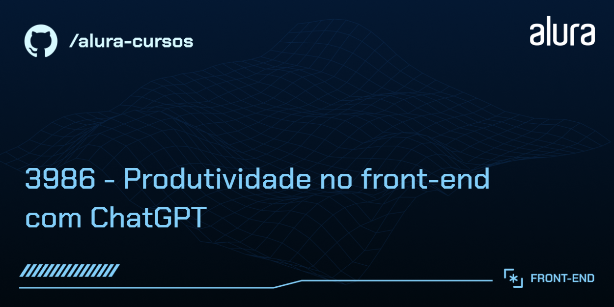
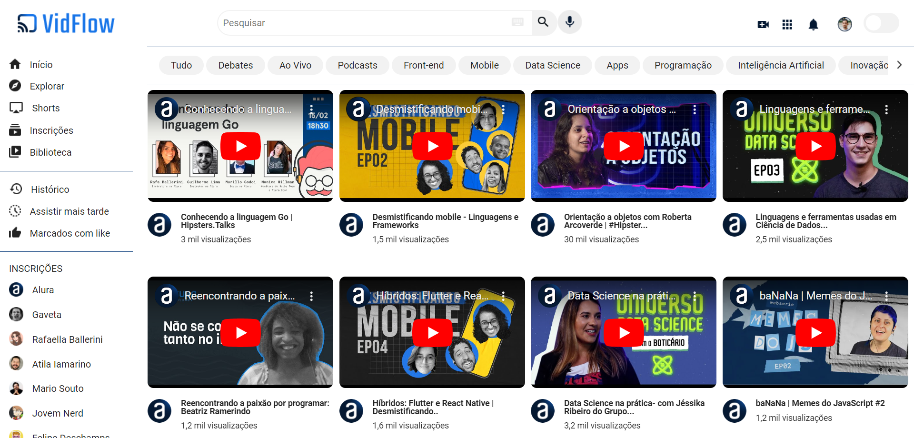

# VidFlow

O VidFlow é uma plataforma de compartilhamento de vídeos.



## 🔨 Funcionalidades do projeto

Atualmente, o projeto já possui algumas funcionalidades, como busca de vídeos a uma API.

Agora utilizaremos o ChatGPT para nos ajudar a implementar novas funcionalidades, como o modo escuro, validação de email com regex e modal.

## ✔️ Técnicas e tecnologias utilizadas

- HTML, CSS e JavaScript
- JSON Server

## Link do Figma

[Acesse o Figma do Vidflow](https://www.figma.com/design/wucq0XXhlHBFc3XDEC2CbQ/VidFlow-%7C-Produtividade-em-Front-end?node-id=2207-2709&t=psLUKS2TgFBfdSkL-1).

## 🛠️ Abrir e rodar o projeto

Após baixar ou clonar o projeto deste repositório, você precisa ter o [Node.js](https://nodejs.org/) e o [`json-server`](https://www.npmjs.com/package/json-server) instalados.

Caso não tenha o `json-server` instalado globalmente, execute o seguinte comando:

```bash
npm install -g json-server@0.17.4
```

Com o Node.js e o `json-server` instalados, execute o seguinte comando para disponibilizar a API local de vídeos:

```bash
json-server --watch backend/videos.json
```

Em seguida, abra o `index.html` no navegador e o VidFlow já pode ser visualizado!
